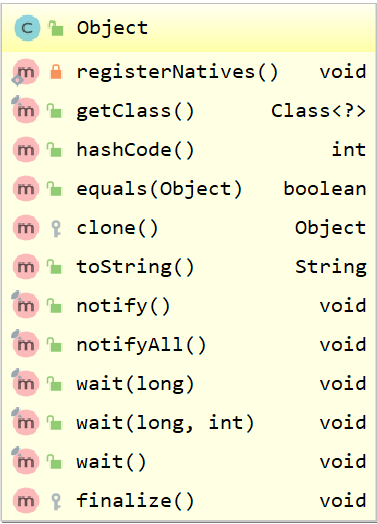
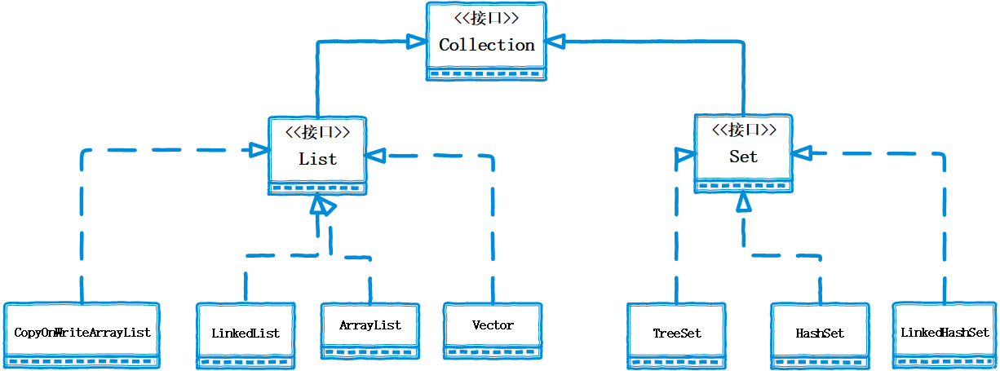
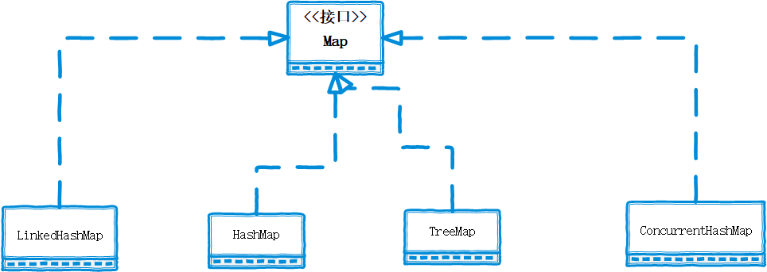
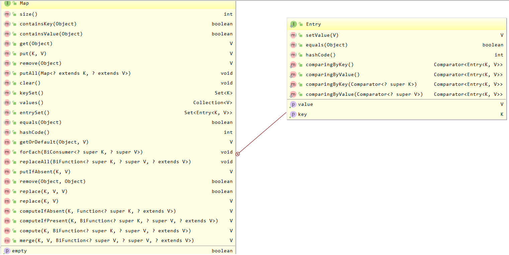
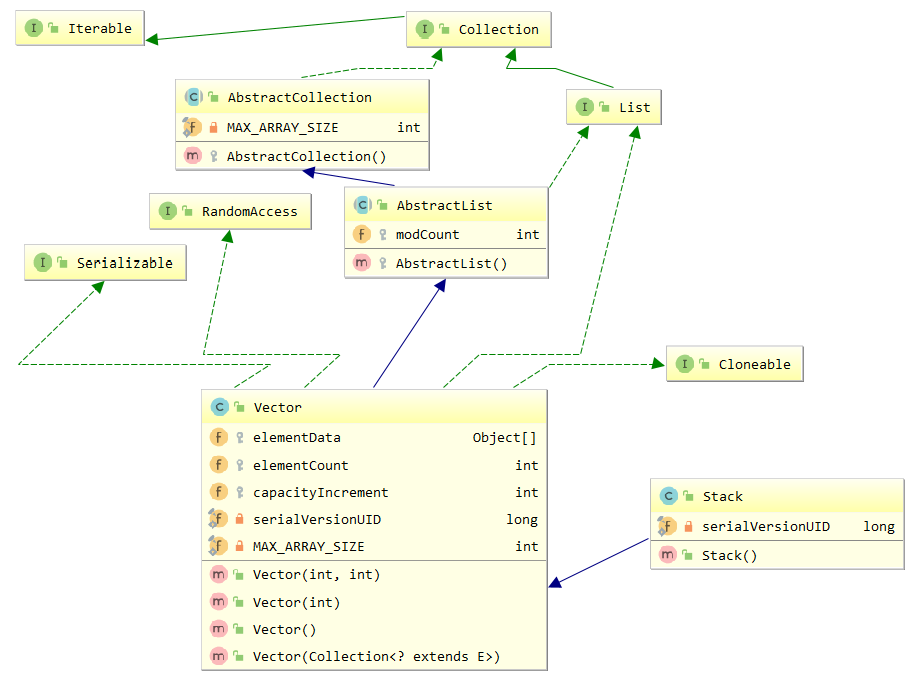
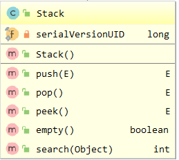
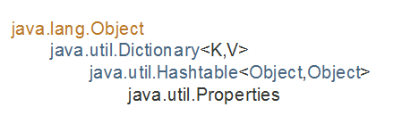
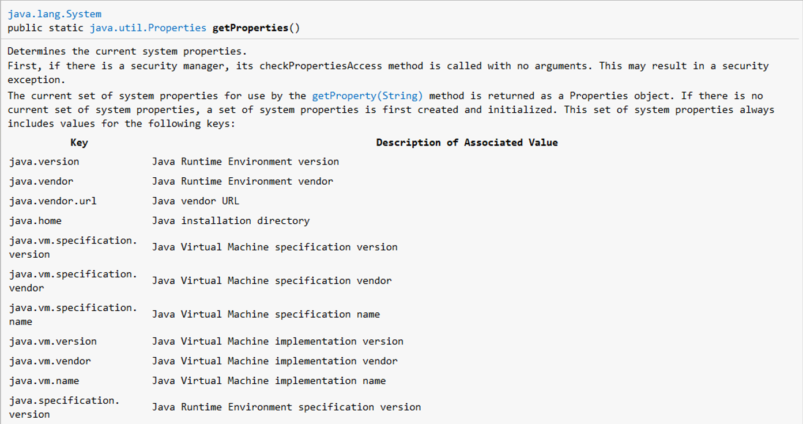
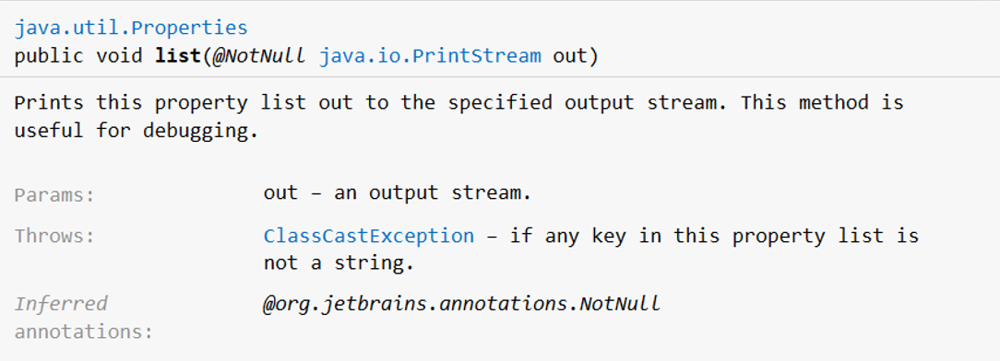

###学习集合之前复习相关知识：

> - **Hash:**翻译为散列、哈希，所以散列和哈希指的是同一个概念。
>
> - **散列码：**一种标识码，由散列码算法确定。
>
> > ```markdown
> >“散列码”就是用来把一堆对象散到各自的队列里去的一种标识码。
> >
> >举个形象一点的例子，一年有 365 天，从 1 编号到 365，下面我定义一种编码方法，每个人按照他生日那天的编号作为他的标识码，这样，一群人每个人就会有一个标识码。
> >
> >这个标识码有什么用呢？好，下面我说，请所有单号的人站到一起，所有双号的人站在一起。此后，当我要找一个人的时候，如果知道他的编号是单号，那我只需要到前面一堆人里去找，查找效率提高了一倍。
> >
> >如果我说，请编号能被 16 整除的人站到一起，被 16 除余 1 的人站到一起，被 16 除余 2 的人站到一起…… 此后，当我要找一个人的时候，查找效率就会提高到 16 倍。
> >
> >这就是散列码。所以，一个好的散列码算法，配合一个适当的存储机制，就能够实现高效的存储管理。
> >
> >那么，不好的散列码算法会有多糟糕呢？比如，hashCode() 返回一个常量，那么，无论什么存储机制都会退化，所有的人都站在一堆里，查找效率无法提高。不过，也就只是影响效率，不会影响“正确性”，因为散列码的本性决定了，所有的算法都不应该假设两个不同的对象必须有不同的散列码。 
> > ```
> >
>
> - **哈希表（也叫散列表）：**
>   - 结合了数组和链表的优势，其实就是一种特殊的数据结构
>   - 哈希表有多种不同的实现方法


- **红黑树**
  - 之前学习过二叉树，红黑树也是一种树形的数据结构

看一下Object类中定义的方法



> - **toString()方法：**
>
>   - 返回对象的字符串表示形式，可以自己书写返回的格式（类型是字符串）
>
> - **equals()方法和双等号：**
>   - **equals：**进行值的比较
>   - **==：**进行值和引用对象的地址是否一致
>
> - **hashCode()方法：**
>
>   - 返回对象的哈希码值
>
> 
>
>   - ```java
>        /**
>        *This method is supported for the benefit of hash tables such as those *provided by java.util.HashMap
>        *支持此方法是为了哈希表的优势，例如由HahMap提供的哈希表
>        **/
>        ```
>    ```
> 
>    ```
>
> ```
> 
> ```
>
>   - **Java中`HashCode()`方法就是根据一定的规则将于对象相关的信息（比如对象的存储地址、对象的字段等）映射成一个值，这个数值就是哈希码值（也叫散列码值）**
> ```
> 
> ```
>
> ```
> 
> ```

- **Comparable接口：**
  - 内部比较器，实现了此接口的类可与自身对象进行比较，依赖于CompareTo()方法的实现，CompareTo()方法有三个返回值
  - [Comparable和Comparator区别](https://www.jianshu.com/p/f3b85a56f018)

### 一、类集

####1、集合的作用

- **集合和对象数组类似，都是保存对象的容器。但是集合更加强大，提供了添加、遍历、排序和删除等一系列基本操作，且集合可以动态扩容。**

- **在实际开发中，大多数情况下数据的测定依赖于对象的传递，只有极少数是在操作具体的数据（联系DAO开发模式）**

  

#### 2、操作单值对象的集合-Collection家装

- **以下的实现类不是直接实现接口的，省略了一部分抽象类（Map家族也是）**、
- **Collection家族是对单值进行操作的集合**




####3、操作二元偶对象的集合-Map家族

- **存储结构是key-value键值对，不像Collection是单列集合**
- **必须知道什么是散列表和红黑树**





### 二、Collection接口

- **Collection接口提供了一系列操作集合的方法**


####1、Collection有两大子接口

- **List：**
  - 有序，元素可重复
  - 允许为null
- **Set：**
  - 无序,不可重复
  - 底层大多是Map结构的实现
  - 常用的三个实现类（HashSet、TreeSet、LinkedHashSet）都是线程非同步
- **Collection的使用必须依赖于两大子接口的实现类**

### 三、List接口

- **List接口继承了Collection接口**


####1、常用的实现类

> - **`ArrayList`:①可调整大小的数组的实现②非线程安全③采用异步处理，性能更优**
>
>   
>
> - **`Vector`:①用法与`ArrayList`相似②线程安全③采用同步处理方式，性能较低**
>
>   
>
> - **`LinkedList`:实现链表结构，即实现了`List`接口又实现了`Queue`接口**

##### （1）、ArrayList

- ArrayList是数组结构

```java
package com.alexanderbai.collection.list;

import java.util.ArrayList;
import java.util.Iterator;
import java.util.List;
import java.util.Objects;

/**
 * @Author AlexanderBai
 * @data 2019/3/26 17:00
 */
class Person implements Comparable<Person>{
    private String name;
    private int age;

    public Person() {
    }

    public Person(String name, Integer age) {
        this.name = name;
        this.age = age;
    }

    public String getName() {
        return name;
    }

    public void setName(String name) {
        this.name = name;
    }

    public Integer getAge() {
        return age;
    }

    public void setAge(Integer age) {
        this.age = age;
    }

    @Override
    public boolean equals(Object o) {//覆写equals方法
        if (this == o){ //判断地址是否相等
            return true;
        }
        if (!(o instanceof Person)) {//判断是否属于同一类对象
            return false;
        }
        /*上面的代码等价于
        if (o == null || this.getClass() != o.getClass()) {
            return false;
        }
        */
        Person person = (Person) o;
        return Objects.equals(name, person.name) &&//依次进行属性比较
                Objects.equals(age, person.age);
       /*上面的代码等价于
        if (this.name.equals(person.name) && this.age == person.age) {
            return true;
        } else {
            return false;
        }
        */
    }
    @Override
    public int hashCode() {//覆写hashCode()的方法
        return this.name.hashCode() * this.age;//计算公式
    }
    @Override
    public String toString() {
        return "姓名："+this.name +";年龄:"+this.age;
    }
    @Override
    public int compareTo(Person person) {//覆写comparTo()方法，指定排序规则
        if (this.age>person.age) {
            return 1;
        }
        if (this.age < person.age) {
            return -1;
        }
        return this.name.compareTo(person.name); //增加字符串的比较
    }
}

public class TestList {
    public static void main(String[] args) {
        List<String> listString = new ArrayList<>();
        //1、添加类库元素
        listString.add("Hello");
        listString.add("World!!");
        System.out.println("listString = " + listString);
        listString.remove("hello");
        System.out.println("listString = " + listString);

        //2、添加自定义元素
        List<Person> personList = new ArrayList<>();
        personList.add(new Person());
        personList.add(new Person("AlexanderBai",20));
        personList.add(new Person("Alexander",21));

        System.out.println("personList = " + personList);
        System.out.println("-------------------------------------------------------");
        personList.remove(new Person());
        //3、输出
        //第一种输出，集合的标准输出
        Iterator<Person> iterator=personList.iterator();
        while (iterator.hasNext()) {
            Person person=iterator.next();
            System.out.println(person.toString());
        }
        
        System.out.println("-------------------------------------------------------");
        //forEach输出
        for (Person person: personList) {
            System.out.println(person.toString());

        }

        System.out.println("-------------------------------------------------------");
        //简单佛如循环
        for (int i = 0; i <(personList.size()); i++) {
            System.out.println("personList.get("+i+") = " + personList.get(i));

        }
    }
}
```

#####（2）、Vector

- 用法与ArrayList相似

```java
public class TestList {
    public static void main(String[] args) {
        List<String> list= new Vector<>();
        list.add("A");
        list.add("B");
        list.add("C");
        list.add("D");
        Iterator<String> iterator=list.iterator();
        while (iterator.hasNext()) {
            String string = iterator.next();
            System.out.println(string);
        }
    }
}
```

#####（3）、LinkedList

- LinkedList是链表结构,实现了**Queue（队列）**接口

```java
public class LinkedList<E>
    extends AbstractSequentialList<E>
    implements List<E>, Deque<E>, Cloneable, java.io.Serializable
```

- 常用方法如下：

| add()                | addAll(Collection<? extends E) | addAll(int ,Collection<? extends E) |
| -------------------- | ------------------------------ | ----------------------------------- |
| addFirst()/addLast() | get()                          | remove()/removeFirst()/removeLast() |
| pop()/push()         | peek()                         | poll()/pollFirst()/pollLast()       |

```java
package com.alexanderbai.collection.list;

import java.util.*;

/**
 * @Author AlexanderBai
 * @data 2019/3/26 17:00
 */
class Person implements Comparable<Person>{
    private String name;
    private int age;

    public Person() {
    }

    public Person(String name, Integer age) {
        this.name = name;
        this.age = age;
    }

    public String getName() {
        return name;
    }

    public void setName(String name) {
        this.name = name;
    }

    public Integer getAge() {
        return age;
    }

    public void setAge(Integer age) {
        this.age = age;
    }

    @Override
    public boolean equals(Object o) {//覆写equals方法
        if (this == o){ //判断地址是否相等
            return true;
        }
        if (!(o instanceof Person)) {//判断是否属于同一类对象
            return false;
        }
        /*上面的代码等价于
        if (o == null || this.getClass() != o.getClass()) {
            return false;
        }
        */
        Person person = (Person) o;
        return Objects.equals(name, person.name) &&//依次进行属性比较
                Objects.equals(age, person.age);
       /*上面的代码等价于
        if (this.name.equals(person.name) && this.age == person.age) {
            return true;
        } else {
            return false;
        }
        */
    }
    @Override
    public int hashCode() {//覆写hashCode()的方法
        return this.name.hashCode() * this.age;//计算公式
    }
    @Override
    public String toString() {
        return "姓名："+this.name +";年龄:"+this.age;
    }
    @Override
    public int compareTo(Person person) {//覆写comparTo()方法，指定排序规则
        if (this.age>person.age) {
            return 1;
        }
        if (this.age < person.age) {
            return -1;
        }
        return this.name.compareTo(person.name); //增加字符串的比较
    }
}

public class TestList {
    public static void main(String[] args) {
        List<Person> linkedList = new LinkedList<>();
        linkedList.add(new Person());
        linkedList.add(new Person("张三", 21));
        linkedList.add(new Person("李四", 22));
        linkedList.add(new Person("王五", 20));
        linkedList.add(new Person("赵六", 19));

        System.out.println("linkedList.get(2) = " + linkedList.get(2));
        System.out.println("((LinkedList<Person>) linkedList).peek() = " + ((LinkedList<Person>) linkedList).peek());//Retrieves(取出）, but does not remove, the head (first element) of this list.
        System.out.println(linkedList);
        
        System.out.println("((LinkedList<Person>) linkedList).getFirst() = " + ((LinkedList<Person>) linkedList).getFirst());
        System.out.println("((LinkedList<Person>) linkedList).getFirst() = " + ((LinkedList<Person>) linkedList).getFirst());
        System.out.println("((LinkedList<Person>) linkedList).peekFirst() = " + ((LinkedList<Person>) linkedList).peekFirst());
        System.out.println(linkedList);
        
        ((LinkedList<Person>) linkedList).addFirst(new Person("新来的", 22));
        System.out.println(linkedList);
        System.out.println("((LinkedList<Person>) linkedList).peekLast() = " + ((LinkedList<Person>) linkedList).peekLast());
        
        Iterator<Person> iterator=linkedList.iterator();
        System.out.println("以先进先出的方式输出：");
        while (iterator.hasNext()) {
            Person person = iterator.next();
            System.out.println(person.toString());
        }
    }
}
```


### 四、Set接口

- **Set接口继承了Collection接口**


####1、常用的实现类

> - **HashSet：**
>   - 底层数据结构是哈希表（是一个元素为链表的数组）+红黑树
>   - 实际上是封装了HashMap
>   - 元素无序，允许为null
>
> 
>
> - **TreeSet**
>
>   - 底层数据结构实际上是一个TreeMap的实例（红黑树）
>   - 可以实现排序功能
>   - 元素不能为空
>
>   
>
> - **LinkedHashSet**
>   - 底层数据结构实际上是一个哈希表（是一个元素为链表的数组）+双向链表
>   - 实际上是LinkHashMap
>   - 允许元素为空

### 五、SortedSet接口

####1、认识Sorted接口

- ```java
  public interface SortedSet<E> extends Set<E> 
  ==================================================================================
  public class TreeSet<E> extends AbstractSet<E>
  ```

- 称为Java排序集-在元素上具有顺序的集合

- 实现Sorted中元素的有序有两种方式：

  - **实现Comparable接口**，使用CompareTo方法来排序元素（如JDK中的String类已经实现了Comparable接口，所以可以添加到Sorted集合中），称为自然排序。
  - 实现Comparator接口，重写compare方法，使之符合自己的需求
  - [Comparable和Comparator区别](https://www.jianshu.com/p/f3b85a56f018)

  >```java
  >package com.alexanderbai.collection.set;
  >
  >import java.util.SortedSet;
  >import java.util.TreeSet;
  >
  >/**
  > * @Author AlexanderBai
  > * @data 2019/3/27 16:23
  > */
  >public class TestSet {
  >    public static void main(String[] args) {
  >        SortedSet<String> stringSortedSet = new TreeSet<>();
  >        stringSortedSet.add("java");
  >        stringSortedSet.add("MySQL");
  >        stringSortedSet.add("css");
  >        stringSortedSet.add("html");
  >        System.out.println(stringSortedSet);
  >    }
  >}
  >```
  >
  >- **运行结果有序：**
  >
  >```java
  >[MySQL, css, html, java]
  >```

####2、指定年龄和姓名同时进行比较

- 年龄和姓名都相同时不会重复添加到集合

  >```java
  >package com.alexanderbai.collection.set;
  >
  >import java.util.Objects;
  >import java.util.SortedSet;
  >import java.util.TreeSet;
  >
  >/**
  > * @Author AlexanderBai
  > * @data 2019/3/27 16:23
  > */
  >public class TestSet {
  >    public static void main(String[] args) {
  >        SortedSet<Person> personSortedSet = new TreeSet<>();
  >        personSortedSet.add(new Person("AlexanderBai", 20));
  >        personSortedSet.add(new Person("alexanderbai", 20));
  >        personSortedSet.add(new Person("alexanderbai", 21));
  >        personSortedSet.add(new Person("alexander", 21));
  >        personSortedSet.add(new Person("alexander", 21));
  >        System.out.println(personSortedSet);
  >    }
  >}
  >class Person implements Comparable<Person>{
  >    private String name;
  >    private int age;
  >
  >    public Person() {
  >    }
  >
  >    public Person(String name, Integer age) {
  >        this.name = name;
  >        this.age = age;
  >    }
  >
  >    public String getName() {
  >        return name;
  >    }
  >
  >    public void setName(String name) {
  >        this.name = name;
  >    }
  >
  >    public Integer getAge() {
  >        return age;
  >    }
  >
  >    public void setAge(Integer age) {
  >        this.age = age;
  >    }
  >
  >    @Override
  >    public boolean equals(Object o) {//覆写equals方法
  >        if (this == o){ //判断地址是否相等
  >            return true;
  >        }
  >        if (!(o instanceof Person)) {//判断是否属于同一类对象
  >            return false;
  >        }
  >        /*上面的代码等价于
  >        if (o == null || this.getClass() != o.getClass()) {
  >            return false;
  >        }
  >        */
  >        Person person = (Person) o;
  >        return Objects.equals(name, person.name) &&//依次进行属性比较
  >                Objects.equals(age, person.age);
  >       /*上面的代码等价于
  >        if (this.name.equals(person.name) && this.age == person.age) {
  >            return true;
  >        } else {
  >            return false;
  >        }
  >        */
  >    }
  >    @Override
  >    public int hashCode() {//覆写hashCode()的方法
  >        return this.name.hashCode() * this.age;//计算公式
  >    }
  >    @Override
  >    public String toString() {
  >        return "姓名："+this.name +";年龄:"+this.age+"\n";
  >    }
  >    @Override
  >    public int compareTo(Person person) {//覆写comparTo()方法，指定排序规则
  >        if (this.age>person.age) {
  >            return 1;
  >        }
  >        if (this.age < person.age) {
  >            return -1;
  >        }
  >        return this.name.compareTo(person.name); //增加字符串的比较
  >    }
  >}
  >```
  >
  >- **运行结果：**
  >
  >```
  >[姓名：AlexanderBai;年龄:20
  >, 姓名：alexanderbai;年龄:20
  >, 姓名：alexander;年龄:21
  >, 姓名：alexanderbai;年龄:21
  >]
  >```

  

####3、指定年龄进行比较

- 年龄相同的不会重复被添加到集合

  >```java
  >package com.alexanderbai.collection.set;
  >
  >import java.util.Comparator;
  >import java.util.Objects;
  >import java.util.SortedSet;
  >import java.util.TreeSet;
  >
  >/**
  >* @Author AlexanderBai
  >* @data 2019/3/27 16:23
  >*/
  >public class TestSet {
  >public static void main(String[] args) {
  >   SortedSet<Person> personSortedSet = new TreeSet<>(Comparator.comparing(Person::getAge));
  >   personSortedSet.add(new Person("AlexanderBai", 20));
  >   personSortedSet.add(new Person("alexanderbai", 20));
  >   personSortedSet.add(new Person("alexanderbai", 21));
  >   personSortedSet.add(new Person("alexander", 21));
  >   System.out.println(personSortedSet);
  >}
  >}
  >class Person{
  >private String name;
  >private int age;
  >
  >public Person() {
  >}
  >
  >public Person(String name, Integer age) {
  >   this.name = name;
  >   this.age = age;
  >}
  >
  >public String getName() {
  >   return name;
  >}
  >
  >public void setName(String name) {
  >   this.name = name;
  >}
  >
  >public Integer getAge() {
  >   return age;
  >}
  >
  >public void setAge(Integer age) {
  >   this.age = age;
  >}
  >
  >@Override
  >public boolean equals(Object o) {//覆写equals方法
  >   if (this == o){ //判断地址是否相等
  >       return true;
  >   }
  >   if (!(o instanceof Person)) {//判断是否属于同一类对象
  >       return false;
  >   }
  >   /*上面的代码等价于
  >   if (o == null || this.getClass() != o.getClass()) {
  >       return false;
  >   }
  >   */
  >   Person person = (Person) o;
  >   return Objects.equals(name, person.name) &&//依次进行属性比较
  >           Objects.equals(age, person.age);
  >  /*上面的代码等价于
  >   if (this.name.equals(person.name) && this.age == person.age) {
  >       return true;
  >   } else {
  >       return false;
  >   }
  >   */
  >}
  >@Override
  >public int hashCode() {//覆写hashCode()的方法
  >   return this.name.hashCode() * this.age;//计算公式
  >}
  >@Override
  >public String toString() {
  >   return "姓名："+this.name +";年龄:"+this.age+"\n";
  >}
  >}
  >```
  >
  >- **运行结果：**
  >
  >```java
  >[姓名：AlexanderBai;年龄:20
  >, 姓名：alexanderbai;年龄:21
  >]
  >```
  >

#### 4、指定姓名进行比较

- 姓名相同的不会重复添加到集合中

  > ```java
  > package com.alexanderbai.collection.set;
  > 
  > import java.util.Comparator;
  > import java.util.Objects;
  > import java.util.SortedSet;
  > import java.util.TreeSet;
  > 
  > /**
  >  * @Author AlexanderBai
  >  * @data 2019/3/27 16:23
  >  */
  > public class TestSet {
  >     public static void main(String[] args) {
  >         SortedSet<Person> personSortedSet = new TreeSet<>(Comparator.comparing(Person::getName));
  >         personSortedSet.add(new Person("AlexanderBai", 20));
  >         personSortedSet.add(new Person("alexanderbai", 20));
  >         personSortedSet.add(new Person("alexanderbai", 21));
  >         personSortedSet.add(new Person("alexander", 21));
  >         System.out.println(personSortedSet);
  >     }
  > }
  > class Person{
  >     private String name;
  >     private int age;
  > 
  >     public Person() {
  >     }
  > 
  >     public Person(String name, Integer age) {
  >         this.name = name;
  >         this.age = age;
  >     }
  > 
  >     public String getName() {
  >         return name;
  >     }
  > 
  >     public void setName(String name) {
  >         this.name = name;
  >     }
  > 
  >     public Integer getAge() {
  >         return age;
  >     }
  > 
  >     public void setAge(Integer age) {
  >         this.age = age;
  >     }
  > 
  >     @Override
  >     public boolean equals(Object o) {//覆写equals方法
  >         if (this == o){ //判断地址是否相等
  >             return true;
  >         }
  >         if (!(o instanceof Person)) {//判断是否属于同一类对象
  >             return false;
  >         }
  >    /*上面的代码等价于
  >    if (o == null || this.getClass() != o.getClass()) {
  >        return false;
  >    }
  >    */
  >         Person person = (Person) o;
  >         return Objects.equals(name, person.name) &&//依次进行属性比较
  >                 Objects.equals(age, person.age);
  >   /*上面的代码等价于
  >    if (this.name.equals(person.name) && this.age == person.age) {
  >        return true;
  >    } else {
  >        return false;
  >    }
  >    */
  >     }
  >     @Override
  >     public int hashCode() {//覆写hashCode()的方法
  >         return this.name.hashCode() * this.age;//计算公式
  >     }
  >     @Override
  >     public String toString() {
  >         return "姓名："+this.name +";年龄:"+this.age+"\n";
  >     }
  > }
  > ```
  >
  > - **运行结果：**
  >
  >   ```java
  >   [姓名：AlexanderBai;年龄:20
  >   , 姓名：alexander;年龄:21
  >   , 姓名：alexanderbai;年龄:20
  >   ]
  >   ```
  >
  >   

### 六、集合的输出

#### 1、Iterator迭代输出

Iterator只能进行单向的遍历，调用iterator()方法是注意类型转换

```java
Iterator<String> iterator=list.iterator();
```

####2、双向迭代输出

- 使用ListIterator进行由后往前迭代输出时必须先进行由前向后的输出操作

```java

public class TestList {
    public static void main(String[] args) {
        List<String> list= new Vector<>();
        list.add("A");
        list.add("B");
        list.add("C");
        list.add("D");
        ListIterator<String> listIterator=list.listIterator();
        System.out.println("由前向后输出：");
        while (listIterator.hasNext()) {
            String string = listIterator.next();
            System.out.println(string);

        }
        System.out.println("由后往前输出：");
        while (listIterator.hasPrevious()) {
            String string = ((ListIterator<String>) listIterator).previous();
            System.out.println(string);
        }
    }
}
```

####3、foreach输出

集合也支持foreach和简单for循环的输出（见List接口的实现类ArrayList的输出操作）

###七、Map接口

- 实际上Map不是一个集合，而是一个集合<key>到另一个集合<value>的映射，即Entry<key,value>.

- Entry是一个Map中的接口，用来存储实际的数据，当我们调用Map的put()方法来存储数据，其实是把数据放入Entry中。

  ~~~
  interface Entry<K,V> 
  ~~~

  


#### 1、Map常用的实现类

- ~~~java
  public class HashMap<K,V> 
  	extends AbstractMap<K,V>
      	implements Map<K,V>, Cloneable, Serializable
  ~~~

- >```java
  >   public class TreeMap<K,V>
  >   extends AbstractMap<K,V>
  >    	implements NavigableMap<K,V>, Cloneable, java.io.Serializable
  >```
  >
  >```java
  >public interface NavigableMap<K,V> extends SortedMap<K,V>
  >```
  >
  >```java
  >public interface SortedMap<K,V> extends Map<K,V>
  >```

  

- ```java
  public class LinkedHashMap<K,V>
      extends HashMap<K,V>
      	implements Map<K,V>
  ```

- ```java
  public class ConcurrentHashMap<K,V>
  	extends AbstractMap<K,V> 
  		implements ConcurrentMap<K,V>, Serializable
  ```

  

##### （1）、HashMap

- 无序存放，key不允许重复，允许为null

- 与之类似的还有HashTable（也是Map的实现类），**已过时**

  ```java
  package com.alexanderbai.map;
  
  import java.util.*;
  
  /**
   * @Author AlexanderBai
   * @data 2019/3/28 8:52
   */
  public class TestMap {
      public static void main(String[] args) {
  
          Map<Integer, String> map = new HashMap<>();
          map.put(1,"AlexanderBai" );
          map.put(2, "xiaobai");
          map.put(3, "dalao");
  
          System.out.print("通过key获取value值:");
          System.out.println("map.get(2) = " + map.get(2));
  
          System.out.print("以set集合的方式返回map集合:");
          System.out.println(map.entrySet());
  
          System.out.print("判断是否含有指定的key:");
          if (map.containsKey(3)) {
              System.out.println("key=3,value=" + map.get(3));
          } else {
              System.out.println("搜索的key不存在");
          }
  
          System.out.print("判断是否含有指定的value值:");
          if (map.containsValue("boss")) {
              System.out.println("搜索的value存在");
          } else {
              System.out.println("搜索的value不存在");
          }
  
          System.out.println("以set的方式返回所有的key，并输出全部的key");
          Set<Integer> keys=map.keySet();
          Iterator<Integer> integerIterator=keys.iterator();
          while (integerIterator.hasNext()) {
              System.out.print(integerIterator.next()+"、");
          }
  
          System.out.println();
  
          System.out.println("以Collection的方式返回value，并输出全部的value");
          Collection<String> values=map.values();
          Iterator<String> iterator=values.iterator();
          while (iterator.hasNext()) {
              System.out.print(iterator.next()+"、");
          }
          
          System.out.println();
  
          System.out.println("输出map集合:");
          Set<Integer> keys1=map.keySet();
          Iterator<Integer> integerIterator1=keys.iterator();
          while (integerIterator1.hasNext()) {
              Integer integer=integerIterator1.next();
              System.out.println("key="+integer+",value="+map.get(integer));
          }
      }
  }
  ```

- 运行结果

> ```java
> 通过key获取value值:map.get(2) = xiaobai
> 以set集合的方式返回map集合:[1=AlexanderBai, 2=xiaobai, 3=dalao]
> 判断是否含有指定的key:key=3,value=dalao
> 判断是否含有指定的value值:搜索的value不存在
> 以set的方式返回所有的key，并输出全部的key
> 1、2、3、
> 以Collection的方式返回value，并输出全部的value
> AlexanderBai、xiaobai、dalao、
> 输出map集合:
> key=1,value=AlexanderBai
> key=2,value=xiaobai
> key=3,value=dalao
> ```

##### （2）、TreeMap

- 实现了Sorted接口，属于可以排序的集合，按集合中的key进行排序，元素不允许重复

  ```java
  package com.alexanderbai.map;
  
  import java.util.*;
  
  /**
   * @Author AlexanderBai
   * @data 2019/3/28 8:52
   */
  
  class Person {
      private String name;
      private int age;
  
      public Person() {
      }
  
      public Person(String name, int age) {
          this.name = name;
          this.age = age;
      }
  
      public String getName() {
          return name;
      }
  
      public void setName(String name) {
          this.name = name;
      }
  
      public int getAge() {
          return age;
      }
  
      public void setAge(int age) {
          this.age = age;
      }
  
      @Override
      public String toString() {
          return "Person{" +
                  "name='" + name + '\'' +
                  ", age=" + age +
                  '}';
      }
  }
  
  public class TestMap {
      public static void main(String[] args) {
          Map<Integer, String> map = new TreeMap<>();
          map.put(2, "AlexanderBai");
          map.put(1, "xiaobai");
          map.put(0, "boss");
  
          System.out.println(((TreeMap<Integer, String>) map).firstKey());
          System.out.println(((TreeMap<Integer, String>) map).lastKey());
  
          System.out.println(((TreeMap<Integer, String>) map).firstEntry());
          System.out.println(((TreeMap<Integer, String>) map).lastEntry());
  
          Set<Integer> integerSet = map.keySet();
          Iterator<Integer> integerIterator = integerSet.iterator();
          while (integerIterator.hasNext()) {
              Integer integer = integerIterator.next();
              System.out.println("key=" + integer + ",value=" + map.get(integer));
          }
  
          Map<String, Person> map1 = new TreeMap<>();
          map1.put("B", new Person("AlexanderBai",20));
          map1.put("C", new Person("xiaobai", 18));
          map1.put("A", new Person("boss", 38));
          System.out.println(((TreeMap<String, Person>) map1).firstKey());
          System.out.println(((TreeMap<String, Person>) map1).lastKey());
  
          System.out.println(((TreeMap<String , Person>) map1).firstEntry());
          System.out.println(((TreeMap<String, Person>) map1).lastEntry());
  
          Set<String> stringSet = map1.keySet();
          Iterator<String> stringIterator =stringSet.iterator();
          while (stringIterator.hasNext()) {
              String str= stringIterator.next();
              System.out.println("key=" + str + ",value=" + map1.get(str));
          }
      }
  }
  ```

- 运行结果

  > ```
  > 0
  > 2
  > 0=boss
  > 2=AlexanderBai
  > key=0,value=boss
  > key=1,value=xiaobai
  > key=2,value=AlexanderBai
  > A
  > C
  > A=Person{name='boss', age=38}
  > C=Person{name='xiaobai', age=18}
  > key=A,value=Person{name='boss', age=38}
  > key=B,value=Person{name='AlexanderBai', age=20}
  > key=C,value=Person{name='xiaobai', age=18}
  > ```
- 从运行结果可以看出，TreeMap实现了Map集合元素的排序，上述以key作为排序对象

#####（3）、LinkedHashMap

- 允许为null，插入有序

- 是HashMap的子类

```java
public class LinkedHashMap<K,V>
    extends HashMap<K,V>
    implements Map<K,V>
```

- 大多使用HashMap的API，只不过重写了部分方法，所以用法与HashMap类似

- 简单来说就是Map集合的哈希表和链表（包括双向链表）的实现

  ```java
  public class TestMap {
      public static void main(String[] args) {
          Map<Integer, String> map = new LinkedHashMap<>();
          map.put(1, "boss");
          map.put(2, "xiaobai");
          map.put(3, "AlexanderBai");
  
          System.out.print("通过key获取value值:");
          System.out.println("map.get(2) = " + map.get(2));
  
          System.out.print("以set集合的方式返回map集合:");
          System.out.println(map.entrySet());
  
          System.out.print("判断是否含有指定的key:");
          if (map.containsKey(3)) {
              System.out.println("key=3,value=" + map.get(3));
          } else {
              System.out.println("搜索的key不存在");
          }
  
          System.out.print("判断是否含有指定的value值:");
          if (map.containsValue("boss")) {
              System.out.println("搜索的value存在");
          } else {
              System.out.println("搜索的value不存在");
          }
  
          System.out.println("以set的方式返回所有的key，并输出全部的key");
          Set<Integer> keys=map.keySet();
          Iterator<Integer> integerIterator=keys.iterator();
          while (integerIterator.hasNext()) {
              System.out.print(integerIterator.next()+"、");
          }
  
          System.out.println();
  
          System.out.println("以Collection的方式返回value，并输出全部的value");
          Collection<String> values=map.values();
          Iterator<String> iterator=values.iterator();
          while (iterator.hasNext()) {
              System.out.print(iterator.next()+"、");
          }
  
          System.out.println();
  
          System.out.println("输出map集合:");
          Set<Integer> keys1=map.keySet();
          Iterator<Integer> integerIterator1=keys.iterator();
          while (integerIterator1.hasNext()) {
              Integer integer=integerIterator1.next();
              System.out.println("key="+integer+",value="+map.get(integer));
          }
      }
  }
  ```


##### （4）、ConcurrentHashMap

- key和value都不能为空
- 一般用于高并发和大数统计

```java
public class TestMap {
    public static void main(String[] args) {
        Map<Integer, String> map = new ConcurrentHashMap<>();
        map.put(1, "c");
        map.put(2, "b");
        map.put(3, "a");

        map.put(6, "boss");
        map.put(5, "xiaobai");
        map.put(4, "AlexanderBai");

        System.out.print("通过key获取value值:");
        System.out.println("map.get(2) = " + map.get(2));

        System.out.print("以set集合的方式返回map集合:");
        System.out.println(map.entrySet());

        System.out.print("判断是否含有指定的key:");
        if (map.containsKey(3)) {
            System.out.println("key=3,value=" + map.get(3));
        } else {
            System.out.println("搜索的key不存在");
        }

        System.out.print("判断是否含有指定的value值:");
        if (map.containsValue("boss")) {
            System.out.println("搜索的value存在");
        } else {
            System.out.println("搜索的value不存在");
        }

        System.out.println("以set的方式返回所有的key，并输出全部的key");
        Set<Integer> keys=map.keySet();
        Iterator<Integer> integerIterator=keys.iterator();
        while (integerIterator.hasNext()) {
            System.out.print(integerIterator.next()+"、");
        }

        System.out.println();

        System.out.println("以Collection的方式返回value，并输出全部的value");
        Collection<String> values=map.values();
        Iterator<String> iterator=values.iterator();
        while (iterator.hasNext()) {
            System.out.print(iterator.next()+"、");
        }

        System.out.println();

        System.out.println("输出map集合:");
        Set<Integer> keys1=map.keySet();
        Iterator<Integer> integerIterator1=keys.iterator();
        while (integerIterator1.hasNext()) {
            Integer integer=integerIterator1.next();
            System.out.println("key="+integer+",value="+map.get(integer));
        }
    }
}
```

### 八、SortedMap接口

```java
public interface SortedMap<K,V> extends Map<K,V>
```

- SortedMap是Map的直接子类，是要于排序的接口，实现此接口的子类都属于排序的子类，如：**TreeMap**

> ```java
> public class TreeMap<K,V>
>     extends AbstractMap<K,V>
>     	implements NavigableMap<K,V>, Cloneable, java.io.Serializable
> ```
>
> ```java
> public interface NavigableMap<K,V> extends SortedMap<K,V>
> ```

- TreeMap是SortedMap的实现类，SortedMap的使用见TreeMap的使用方法
- 同时也可以类比SortedSet的使用

### 九、其他集合类

| 数组`ArrayList` | 链表`LinkedList` |
| :-------------: | :--------------: |
|    栈`Stack`    |   队列`Queue`    |

- **ArrayList:可调整大小的数组的实现**
- **LinkedList:双链表，即实现了List接口又实现了Queue接口**
- **Stack：堆栈的实现类**
- **Queue：队列的实现类**

#### 1、Stack类

- **栈：**一种元素先进后出的数据结构，其中元素可以是基本数据类型，也可以是引用类型
- **栈的继承关系：**



- **栈的常用方法：**

  


>```java
>package com.alexanderbai.collection.set;
>
>import java.util.Stack;
>
>/**
> * @Author AlexanderBai
> * @data 2019/3/27 17:17
> */
>public class TestStack {
>    public static void main(String[] args) {
>        Stack<String> stringStack=new Stack<>();
>        stringStack.add("B");
>        stringStack.add("f");
>        stringStack.add("A");
>        stringStack.add("c");
>        stringStack.add("b");
>        System.out.println("stringStack.empty() = " + stringStack.empty());
>        System.out.println("stringStack = " + stringStack);
>        System.out.println("stringStack.peek() = " + stringStack.peek());
>        System.out.println("stringStack = " + stringStack);
>        System.out.println("stringStack.pop() = " + stringStack.pop());
>        System.out.println("stringStack = " + stringStack);
>        System.out.println("stringStack.lastElement() = " + stringStack.lastElement());
>        System.out.print("新增元素：");
>        stringStack.addElement("AlexanderBai");
>        System.out.println("stringStack = " + stringStack);
>        System.out.println("stringStack.contains(\"Alexander\") = " + stringStack.contains("Alexander"));
>        System.out.print("清空栈");
>        stringStack.removeAllElements();
>        System.out.println("stringStack = " + stringStack);
>    }
>}
>```
>
>- **运行结果：**
>
>  ```java
>  stringStack.empty() = false
>  stringStack = [B, f, A, c, b]
>  stringStack.peek() = b
>  stringStack = [B, f, A, c, b]
>  stringStack.pop() = b
>  stringStack = [B, f, A, c]
>  stringStack.lastElement() = c
>  新增元素：stringStack = [B, f, A, c, AlexanderBai]
>  stringStack.contains("Alexander") = false
>  清空栈stringStack = []
>  ```

####2、Queue类

- **队列：**一种元素先进先出的数据结构，其中元素可以是基本数据类型，也可以是引用类型

```java
public interface Queue<E> extends Collection<E> 
```

```java
public class LinkedList<E>
    extends AbstractSequentialList<E>
    implements List<E>, Deque<E>, Cloneable, java.io.Serializable
```

```

- **Queue的实现类有`LinkedList`，使用方法见`LinkedList`**
```

#### 3、属性类Properties



- Properties一般用于配置文件，以key-value的结构存储

- 如常用的有关`jdbc`连接数据库的配置

#####（1）、获取JVM属性

```java
package com.alexanderbai.collection;

import java.util.Properties;

/**
 * @Author AlexanderBai
 * @data 2019/3/25 21:51
 */
public class PropertiesFileReadTest {
    public static void main(String[] args) {
        Properties properties=System.getProperties();
        properties.list(System.out);
    }
}
```

**getProperties()方法说明：**

- 此方法用于获取JVM的系统属性



list的说明：将属性以指定流的形式打印（上面是在控制台打印）

#####（2）、读取任意的配置文件

```java
package com.alexanderbai.collection;

import java.io.FileInputStream;
import java.io.FileReader;
import java.io.IOException;
import java.io.InputStream;
import java.util.Enumeration;
import java.util.Properties;

/**
 * 读取和类在同一包下的属性文件
 * @Author AlexanderBai
 * @data 2019/3/25 21:51
 */
public class PropertiesFileReadTest {
    public static void main(String[] args) {
        Properties properties = new Properties();
        InputStream inputStream=null;
        //此方法配置文件和类必须再同一包想 
     inputStream=PropertiesFileReadTest.class.getResourceAsStream("test.properties"); 
        try {
            properties.load(inputStream);
        } catch (IOException e) {
            e.printStackTrace();
        }
        Enumeration propertyNames=properties.propertyNames();
        while (propertyNames.hasMoreElements()) {
            String key= (String) propertyNames.nextElement();
            String value=properties.getProperty(key);
            System.out.println( key +"="+value);
        }
    }
}
```

#####（3）、读取有关jdbc的配置属性

>- 下面两个文件都在`com.alexanderbai.dbutil`包下
>- **dbConfig.properties**
>
>```properties
>driver=com.mysql.jdbc.Driver
>url=jdbc:mysql://localhost:3306/scott
>userName=root
>password=ROOT
>```
>
>- **DBConnectionUtil.java**
>
>```java
>package com.alexanderbai.dbutil;
>
>import java.io.IOException;
>import java.sql.Connection;
>import java.sql.Driver;
>import java.sql.DriverManager;
>import java.sql.SQLException;
>import java.util.Properties;
>
>/**
>* @Author AlexanderBai
>* @data 2019/3/26 0:07
>*/
>public class DBConnectionUtil {
>
>public  Connection openConnection() {
>Properties properties = new Properties();
>String driver = null;
>String url = null;
>String userName = null;
>String password = null;
>try {
>  properties.load(
>          this.getClass().getResourceAsStream("dbConfig.properties")
>  );
>} catch (IOException e) {
>  e.printStackTrace();
>}
>driver = properties.getProperty("driver");
>url = properties.getProperty("url");
>userName= properties.getProperty("userName");
>password= properties.getProperty("password");
>
>try {
>  Class.forName(driver);
>  return DriverManager.getConnection(url, userName, password);
>} catch (SQLException e) {
>  e.printStackTrace();
>} catch (ClassNotFoundException e) {
>  e.printStackTrace();
>}
>return null;
>}
>
>public static void main(String[] args) {
>DBConnectionUtil dbConnectionUtil = new DBConnectionUtil();
>System.out.println("dbConnectionUtil.openConnection() = " + dbConnectionUtil.openConnection());
>	}
>}
>```
>

### 十、后言

**以上只是java中集合框架的最基础部分，随着学习的深入，应该进一步学习java集合框架的源码实现，只有弄明白源码，才能真正领悟java类集的联系与区别。***

### 十一、Demo

#### 1、一对多关系

- 以学生和所在的学校为例，一名学生只能在一个学校，而一个学校考研包含多个学生。

- **School.java**

  >```java
  >package com.alexanderbai.demo;
  >
  >import java.util.ArrayList;
  >import java.util.List;
  >
  >/**
  > * @Author AlexanderBai
  > * @data 2019/3/28 11:48
  > */
  >public class School {
  >    private String name;
  >    private List<Student> studentList = null;
  >
  >    public School() {
  >        this.studentList=new ArrayList<>();
  >    }
  >
  >    public School(String name) {
  >        this();//调用无参构造函数
  >        this.name = name;
  >    }
  >
  >    public String getName() {
  >        return name;
  >    }
  >
  >    public void setName(String name) {
  >        this.name = name;
  >    }
  >
  >    public List<Student> getStudentList() {
  >        return studentList;
  >    }
  >
  >    public void setStudentList(List<Student> studentList) {
  >        this.studentList = studentList;
  >    }
  >
  >    @Override
  >    public String toString() {
  >        return "学校名称:" + this.name;
  >    }
  >}
  >```

- **Student.java**

  >```java
  >package com.alexanderbai.demo;
  >
  >/**
  > * @Author AlexanderBai
  > * @data 2019/3/28 11:44
  > */
  >public class Student {
  >
  >    private Integer id;
  >    private String name;
  >    private School school;
  >
  >    public Student(Integer id, String name) {
  >        this.id = id;
  >        this.name = name;
  >        this.school = school;
  >    }
  >
  >    public Integer getId() {
  >        return id;
  >    }
  >
  >    public void setId(Integer id) {
  >        this.id = id;
  >    }
  >
  >    public String getName() {
  >        return name;
  >    }
  >
  >    public void setName(String name) {
  >        this.name = name;
  >    }
  >
  >    public School getSchool() {
  >        return school;
  >    }
  >
  >    public void setSchool(School school) {
  >        this.school = school;
  >    }
  >
  >    @Override
  >    public String toString() {
  >        return "学号：" + this.id + ",姓名" + this.name;
  >    }
  >}
  >```

- **Test.java**

  > ```java
  > package com.alexanderbai.demo;
  > 
  > import java.util.Iterator;
  > 
  > /**
  >  * @Author AlexanderBai
  >  * @data 2019/3/28 11:54
  >  */
  > public class Test {
  >     public static void main(String[] args) {
  >         School school = new School("牛逼大学");
  >         Student student1 = new Student(1, "AlexanderBai");
  >         Student student2 = new Student(2, "dalao");
  >         Student student3 = new Student(3, "xiaobai");
  > 
  >         //把学生加入到学校中（放入list集合），list是school类的属性
  >         school.getStudentList().add(student1);
  >         school.getStudentList().add(student2);
  >         school.getStudentList().add(student3);
  > 
  >         //给学生确定所在的学校
  >         student1.setSchool(school);
  >         student2.setSchool(school);
  >         student3.setSchool(school);
  > 
  >         System.out.println(school);
  >         Iterator<Student> iterable=school.getStudentList().iterator();
  >         while (iterable.hasNext()) {
  >             System.out.println("\t|-" + iterable.next());
  >         }
  >     }
  > }
  > ```

- **运行结果：**

  >```java
  >学校名称:牛逼大学
  >	|-学号：1,姓名AlexanderBai
  >	|-学号：2,姓名dalao
  >	|-学号：3,姓名xiaobai
  >```


####2、多对多关系

- 以学生和所选课程为例，一名学生可以选多门课程，一门课程可以有多个学生选课。

- **Student.java**

  > ```java
  > package com.alexanderbai.demo;
  > 
  > import java.util.ArrayList;
  > import java.util.List;
  > 
  > /**
  >  * @Author AlexanderBai
  >  * @data 2019/3/28 11:44
  >  */
  > public class Student {
  > 
  >     private Integer id;
  >     private String name;
  >     private List<Course> list = null;
  >     private School school;
  > 
  >     public Student() {
  >         this.list = new ArrayList<>();
  >     }
  > 
  >     public Student(Integer id, String name) {
  >         this();
  >         this.id = id;
  >         this.name = name;
  >     }
  > 
  >     public Integer getId() {
  >         return id;
  >     }
  > 
  >     public void setId(Integer id) {
  >         this.id = id;
  >     }
  > 
  >     public String getName() {
  >         return name;
  >     }
  > 
  >     public void setName(String name) {
  >         this.name = name;
  >     }
  > 
  >     public School getSchool() {
  >         return school;
  >     }
  > 
  >     public void setSchool(School school) {
  >         this.school = school;
  >     }
  > 
  >     public List<Course> getList() {
  >         return list;
  >     }
  > 
  >     public void setList(List<Course> list) {
  >         this.list = list;
  >     }
  > 
  >     @Override
  >     public String toString() {
  >         return "学号：" + this.id + ",姓名" + this.name;
  >     }
  > }
  > ```

- **School.java**

  > ```java
  > package com.alexanderbai.demo;
  > 
  > import java.util.ArrayList;
  > import java.util.List;
  > 
  > /**
  >  * @Author AlexanderBai
  >  * @data 2019/3/28 11:48
  >  */
  > public class School {
  >     private String name;
  >     private List<Student> studentList = null;
  >     private List<Course> courseList = null;
  > 
  >     public School() {
  >         this.studentList=new ArrayList<>();
  >         this.courseList = new ArrayList<>();
  >     }
  > 
  >     public School(String name) {
  >         this();//调用无参构造函数
  >         this.name = name;
  >     }
  > 
  >     public String getName() {
  >         return name;
  >     }
  > 
  >     public void setName(String name) {
  >         this.name = name;
  >     }
  > 
  >     public List<Student> getStudentList() {
  >         return studentList;
  >     }
  > 
  >     public void setStudentList(List<Student> studentList) {
  >         this.studentList = studentList;
  >     }
  > 
  >     public List<Course> getCourseList() {
  >         return courseList;
  >     }
  > 
  >     public void setCourseList(List<Course> courseList) {
  >         this.courseList = courseList;
  >     }
  > 
  >     @Override
  >     public String toString() {
  >         return "学校名称:" + this.name;
  >     }
  > }
  > ```

- **Courese.java**

  > ```java
  > package com.alexanderbai.demo;
  > 
  > import java.util.ArrayList;
  > import java.util.List;
  > 
  > /**
  >  * @Author AlexanderBai
  >  * @data 2019/3/28 12:15
  >  */
  > public class Course {
  >     private Integer No;
  >     private String name;
  >     private List<Student> list = null;
  > 
  >     public Course() {
  >         this.list = new ArrayList<>();
  >     }
  > 
  >     public Course(Integer no, String name) {
  >         this();
  >         No = no;
  >         this.name = name;
  >     }
  > 
  >     public Integer getNo() {
  >         return No;
  >     }
  > 
  >     public void setNo(Integer no) {
  >         No = no;
  >     }
  > 
  >     public String getName() {
  >         return name;
  >     }
  > 
  >     public void setName(String name) {
  >         this.name = name;
  >     }
  > 
  >     public List<Student> getList() {
  >         return list;
  >     }
  > 
  >     public void setList(List<Student> list) {
  >         this.list = list;
  >     }
  > 
  >     @Override
  >     public String toString() {
  >         return "课程编号：" + this.No + ",课程名称：" + this.name;
  >     }
  > }
  > ```

- **Test.java**

  > ```java
  > package com.alexanderbai.demo;
  > 
  > import java.util.Iterator;
  > 
  > /**
  >  * @Author AlexanderBai
  >  * @data 2019/3/28 11:54
  >  */
  > public class Test {
  >     public static void main(String[] args) {
  >         School school = new School("牛逼大学");
  > 
  >         Student student1 = new Student(1, "AlexanderBai");
  >         Student student2 = new Student(2, "dalao");
  >         Student student3 = new Student(3, "xiaobai");
  > 
  >         Course course1 = new Course(1, "java");
  >         Course course2 = new Course(2, "JavaEE");
  >         Course course3 = new Course(3, "数据库原理及应用");
  > 
  >         //把学生加入到学校中（放入list集合），list是school类的属性
  >         school.getStudentList().add(student1);
  >         school.getStudentList().add(student2);
  >         school.getStudentList().add(student3);
  > 
  >         //给学生确定所在的学校
  >         student1.setSchool(school);
  >         student2.setSchool(school);
  >         student3.setSchool(school);
  > 
  >         school.getCourseList().add(course1);
  >         school.getCourseList().add(course2);
  >         school.getCourseList().add(course3);
  > 
  >  //-------------------------------模拟学生选课----------------------------------
  >         //向课程类添加学生
  >         course1.getList().add(student1);
  >         course1.getList().add(student3);
  > 
  >         course2.getList().add(student1);
  >         course2.getList().add(student2);
  > 
  >         course3.getList().add(student2);
  >         course3.getList().add(student3);
  > 
  >         //向学生类添加课程
  >         student1.getList().add(course1);
  >         student1.getList().add(course3);
  > 
  >         student2.getList().add(course1);
  >         student2.getList().add(course2);
  > 
  >         student3.getList().add(course2);
  >         student3.getList().add(course3);
  > 
  >         System.out.println(school);
  >         Iterator<Student> iterable=school.getStudentList().iterator();
  >         while (iterable.hasNext()) {
  >             Student student=iterable.next();
  >             System.out.println("\t|-" +student);
  >             Iterator<Course> courseIterator=student.getList().iterator();
  >             while (courseIterator.hasNext()) {
  >                 System.out.println("\t\t|-" + courseIterator.next());
  >             }
  >         }
  > 
  >         System.out.println(school);
  >         Iterator<Course> courseIterator1= school.getCourseList().iterator();
  >         while (courseIterator1.hasNext()) {
  >             Course course=courseIterator1.next();
  >             System.out.println("\t|-" +course);
  >         }
  >     }
  > }
  > ```

- **运行结果：**

  >```java
  >学校名称:牛逼大学
  >	|-学号：1,姓名AlexanderBai
  >		|-课程编号：1,课程名称：java
  >		|-课程编号：3,课程名称：数据库原理及应用
  >	|-学号：2,姓名dalao
  >		|-课程编号：1,课程名称：java
  >		|-课程编号：2,课程名称：JavaEE
  >	|-学号：3,姓名xiaobai
  >		|-课程编号：2,课程名称：JavaEE
  >		|-课程编号：3,课程名称：数据库原理及应用
  >学校名称:牛逼大学
  >	|-课程编号：1,课程名称：java
  >	|-课程编号：2,课程名称：JavaEE
  >	|-课程编号：3,课程名称：数据库原理及应用
  >```

